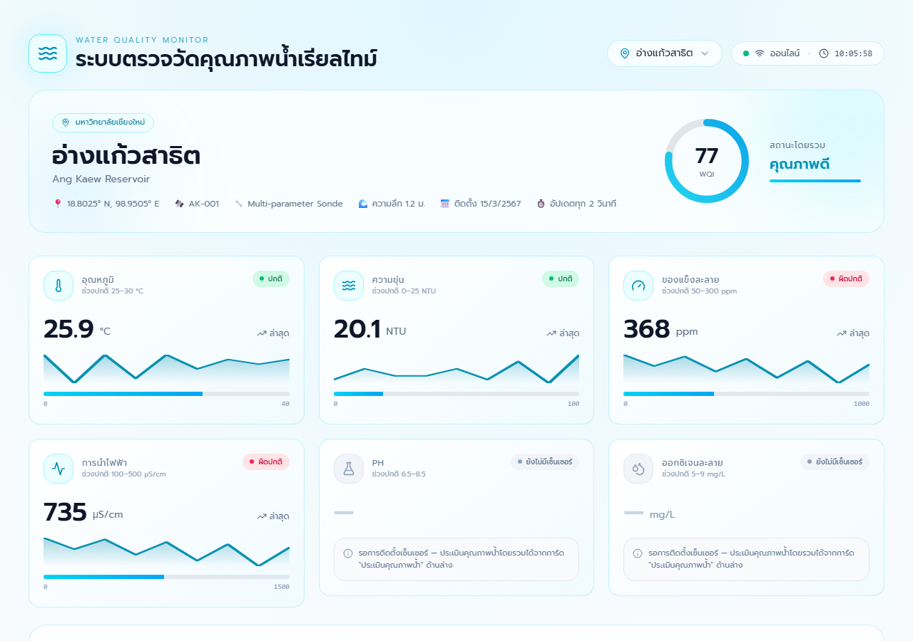
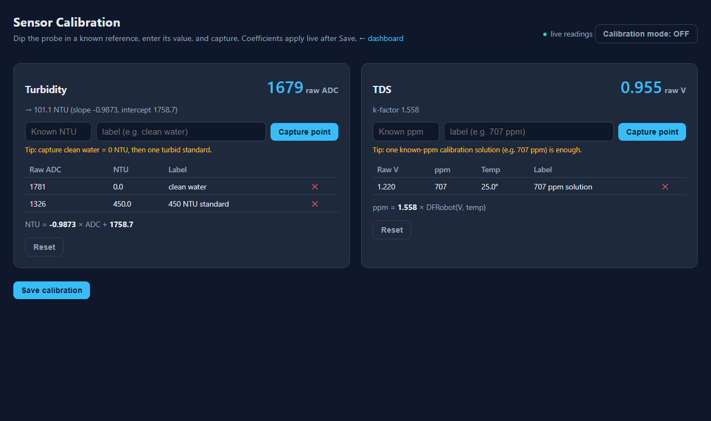

# HydroMonitor — Water Quality Checker

Real-time water quality monitoring for the Ang Kaew reservoir (Satit CMU, Chiang Mai).
An ESP32 board reads temperature, turbidity, and dissolved solids from the water and sends
them to a small server, which shows them live on a web dashboard and logs history to Google
Sheets.



## What it's for

Keeping an eye on water quality continuously instead of taking occasional manual samples.
A single sensor station in the water reports three readings every 2 seconds:

- **Temperature** (°C) — DS18B20 probe
- **Turbidity** (NTU) — how cloudy the water is
- **TDS** (ppm) — total dissolved solids / rough conductivity

The dashboard shows the current values with a normal/abnormal indicator and an overall water
quality score, and a 15-minute history graph. It's built for an educational / community
monitoring setting where non-experts should be able to glance at a page and know if the water
looks healthy.

## How to use

**Run the server** (needs Python 3.11+):

```bash
pip install -r requirements.txt
python main.py            # on Windows: set PYTHONUTF8=1 first
```

Then open **http://localhost:8080/** in a browser — that's the dashboard shown above. On the
same network, power on the ESP32 station; it finds the server automatically (UDP discovery) and
readings start flowing within a couple of seconds. With no station connected, the dashboard
falls back to simulated data so the page stays populated.

**Calibrate the sensors** (do this once per physical sensor, or whenever readings drift):



Open **http://localhost:8080/calibrate**. Dip a probe in a known reference — clean water
(0 NTU) or a known-ppm solution — type the known value, and click **Capture point**. Turbidity
needs two points (clean + one turbid standard); TDS needs one known solution. The page shows
the resulting conversion live; click **Save** and it applies to the dashboard immediately — no
re-flashing the board. See the `sensor-calibration` skill for the full procedure and the sensor
math.

## How it works (briefly)

```
ESP32 station ──raw readings──▶  FastAPI server (main.py)  ──live──▶  Web dashboard
 (temp, turbidity ADC,           - converts raw → NTU / ppm            (WebSocket)
  TDS voltage)  every 2s           using saved calibration      ──log──▶ Google Sheets
      ▲                          - broadcasts to dashboards              (history graph
      └── finds the server via   - serves the /calibrate page            reads back the
          UDP broadcast                                                  last 15 min)
```

- **Station** ([`firmware/esp32/esp32.ino`](firmware/esp32/esp32.ino)) reads the three sensors
  and POSTs the **raw** values to the server. It discovers the server's IP over the network, so
  it keeps working if the server PC's IP changes.
- **Server** ([`main.py`](main.py), FastAPI) turns raw values into real units using the
  calibration saved in `calibration.json`, pushes them to every open dashboard over a WebSocket,
  and relays each reading to Google Sheets for history. Calibration lives on the server, so
  sensors are re-tuned from the web page without touching the firmware.
- **Dashboard** (`web-react/` at `/`, plus a plain-HTML version at `/classic`) subscribes to the
  WebSocket and renders the live values, indicators, and history chart.

More detail — wiring, the calibration math, the discovery protocol, and the Google Sheets
relay — is in [`CLAUDE.md`](CLAUDE.md).
