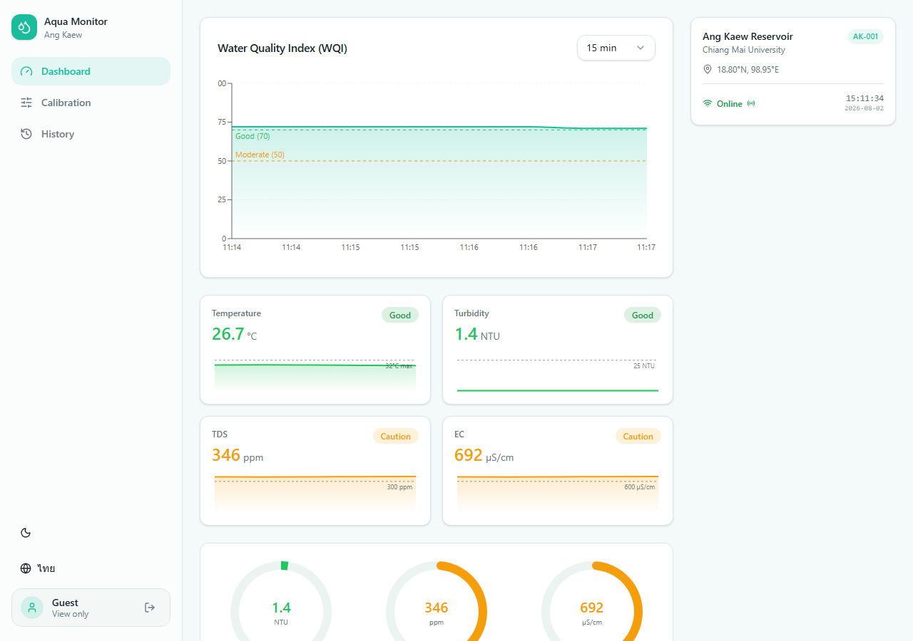
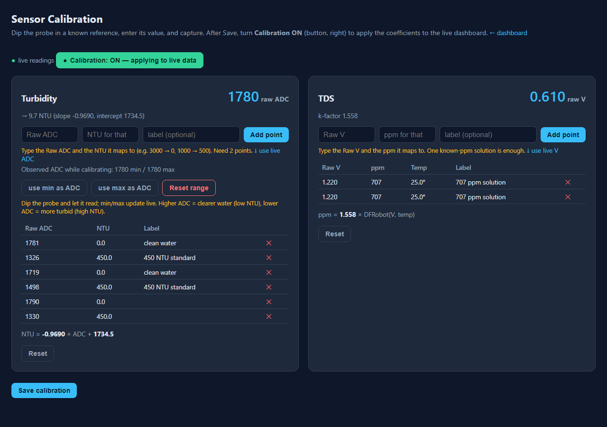

# HydroMonitor — Aqua Monitor

Real-time water quality monitoring for the Ang Kaew reservoir, Chiang Mai University. An
ESP32 board reads temperature, turbidity, and dissolved solids from the water and streams
them to a live, bilingual (English/Thai) web dashboard.

**🇬🇧 [English](#english) · 🇹🇭 [ภาษาไทย](#ภาษาไทย)**

---

## English

### What it's for

Continuous water-quality monitoring instead of occasional manual sampling. A sensor
station in the reservoir reports three raw readings every 2 seconds — **temperature**,
**turbidity** (cloudiness), and **TDS** (total dissolved solids) — which the backend turns
into calibrated units, logs to Google Sheets for history, and streams live to a dashboard
built for an educational / community-monitoring setting.

### How to use



```bash
pip install -r requirements.txt
cd frontend && npm install && npm run build && cd ..
python main.py
```

Open **http://localhost:8080/** — that's the dashboard. With no sensor station connected
yet, the cards show "no readings yet" rather than fake numbers (this project never
fabricates data — a disconnected sensor should look disconnected, not like the water is
quietly changing).

The dashboard has a left sidebar with three tabs:

- **Dashboard** — a Water Quality Index (WQI) trend chart with a selectable time range
  (5 min to 24 hours) and reference lines marking the safe bands; a live 2×2 grid of
  Temperature / Turbidity / TDS / EC cards, each with a 30-second sparkline. **Click any
  card** to open a detail view: a bigger chart with numeric point labels and two-sided
  (too‑high / too‑low) threshold lines, min/avg/max for the selected window, a plain-language
  explanation of the parameter, and — only when the reading is actually out of range — its
  likely impact and a recommendation.
- **Calibration** — turbidity (2‑point) and TDS (single-point k-factor) calibration wired to
  the sensors themselves: dip the probe in a known reference, capture the reading, save. No
  firmware reflash needed. Includes an observed min/max range with one-click "use min" /
  "use max" buttons while a turbidity probe is settling.
- **History** — a sortable table of past readings with CSV export.

A theme toggle (light/dark) and a language switcher (English ⇄ ไทย) live in the sidebar too.
The layout is fully responsive — phone, tablet, and desktop all get a layout suited to the
screen.

A separate lightweight page at **`/calibrate`** offers the same sensor calibration in a
single self-contained HTML file, useful for calibrating from a phone or a machine that
doesn't need the full dashboard.



### How it works, briefly

```
ESP32 station ──raw readings──▶  FastAPI server (main.py)  ──live──▶  Web dashboard
 (temp, turbidity ADC,           - converts raw → NTU / ppm            (WebSocket)
  TDS voltage)  every 2s           using saved calibration      ──log──▶ Google Sheets
      ▲                          - broadcasts to dashboards              (history, newest
      └── finds the server via   - serves the dashboard + API            row at the top)
          UDP broadcast
```

- **Station** ([`firmware/esp32/esp32.ino`](firmware/esp32/esp32.ino)) reads the three
  sensors and POSTs **raw** values to the server, discovering the server's IP automatically
  over the network so it keeps working if the server's IP changes.
- **Server** ([`main.py`](main.py), FastAPI) converts raw values to real units using the
  calibration saved on the server (not the firmware), pushes live readings to every open
  dashboard, and relays each reading to Google Sheets. No fake-data fallback anywhere in
  this chain — a real outage looks like an outage.
- **Dashboard** ([`frontend/`](frontend/) — Vite + React + TypeScript + Tailwind) subscribes
  to the live stream and renders everything above.

More detail — wiring, the calibration math, the Google Sheets contract, the frontend's
architecture — is in [`CLAUDE.md`](CLAUDE.md) and [`AQUA_MONITOR_PLAN.md`](AQUA_MONITOR_PLAN.md).

---

## ภาษาไทย

### จุดประสงค์ของโปรเจกต์นี้

ระบบตรวจสอบคุณภาพน้ำแบบต่อเนื่อง แทนการเก็บตัวอย่างด้วยมือเป็นครั้งคราว สถานีเซนเซอร์ในอ่างเก็บน้ำ
ส่งค่าดิบ 3 ค่าทุก 2 วินาที ได้แก่ **อุณหภูมิ**, **ความขุ่น** (turbidity) และ **TDS**
(ปริมาณสารละลายทั้งหมด) ซึ่งเซิร์ฟเวอร์จะแปลงเป็นหน่วยที่ปรับเทียบแล้ว บันทึกประวัติลง Google Sheets
และส่งขึ้นแดชบอร์ดแบบเรียลไทม์ ออกแบบมาเพื่อใช้งานในบริบทการศึกษาและการติดตามของชุมชน

### วิธีใช้งาน


```bash
pip install -r requirements.txt
cd frontend && npm install && npm run build && cd ..
python main.py
```

เปิด **http://localhost:8080/** จะพบแดชบอร์ด หากยังไม่ได้เชื่อมต่อสถานีเซนเซอร์ การ์ดแต่ละใบจะแสดง
"ยังไม่มีข้อมูล" แทนที่จะแสดงตัวเลขปลอม (โปรเจกต์นี้ไม่มีการสร้างข้อมูลปลอมเด็ดขาด — เซนเซอร์ที่ขาดการเชื่อมต่อ
ควรแสดงผลว่าขาดการเชื่อมต่อจริง ไม่ใช่ทำให้ดูเหมือนน้ำกำลังเปลี่ยนแปลงอยู่)

แดชบอร์ดมีแถบเมนูด้านซ้ายพร้อม 3 แท็บ:

- **แดชบอร์ด** — กราฟแนวโน้มดัชนีคุณภาพน้ำ (WQI) พร้อมตัวเลือกช่วงเวลา (5 นาที ถึง 24 ชั่วโมง)
  และเส้นอ้างอิงระบุช่วงค่าที่ปลอดภัย, ตารางการ์ดแบบเรียลไทม์ 2×2 สำหรับ อุณหภูมิ / ความขุ่น / TDS / EC
  แต่ละใบมีกราฟเส้นย่อยของ 30 วินาทีล่าสุด **คลิกที่การ์ดใดก็ได้** เพื่อเปิดมุมมองรายละเอียด: กราฟขนาดใหญ่พร้อมตัวเลข
  กำกับแต่ละจุดและเส้นเกณฑ์แบบสองด้าน (สูงเกินไป / ต่ำเกินไป), ค่าต่ำสุด/เฉลี่ย/สูงสุดของช่วงเวลาที่เลือก,
  คำอธิบายค่าพารามิเตอร์แบบเข้าใจง่าย และ — เฉพาะเมื่อค่านั้นอยู่นอกช่วงปกติจริง — ผลกระทบที่อาจเกิดขึ้นพร้อมคำแนะนำ
- **ปรับเทียบเซนเซอร์** — ปรับเทียบความขุ่น (2 จุด) และ TDS (ค่า k-factor จุดเดียว) เชื่อมกับเซนเซอร์จริง:
  จุ่มหัววัดในสารละลายอ้างอิงที่ทราบค่า บันทึกค่าที่อ่านได้ แล้วบันทึกผล ไม่ต้องอัปโหลดเฟิร์มแวร์ใหม่
  มีการติดตามค่าต่ำสุด/สูงสุดที่พบระหว่างการปรับเทียบ พร้อมปุ่ม "ใช้ค่าต่ำสุด" / "ใช้ค่าสูงสุด" กดครั้งเดียวใช้ได้เลย
- **ประวัติ** — ตารางค่าที่บันทึกไว้ในอดีต เรียงลำดับได้ และส่งออกเป็นไฟล์ CSV

ปุ่มสลับธีม (สว่าง/มืด) และปุ่มเปลี่ยนภาษา (English ⇄ ไทย) อยู่ในแถบเมนูด้านซ้ายเช่นกัน
หน้าจอปรับตามขนาดอุปกรณ์ได้เต็มรูปแบบ ไม่ว่าจะเป็นมือถือ แท็บเล็ต หรือคอมพิวเตอร์

นอกจากนี้ยังมีหน้าเบา ๆ แยกต่างหากที่ **`/calibrate`** สำหรับปรับเทียบเซนเซอร์ในไฟล์ HTML เดียวจบ
เหมาะสำหรับปรับเทียบจากมือถือหรือเครื่องที่ไม่จำเป็นต้องเปิดแดชบอร์ดเต็มรูปแบบ


### หลักการทำงานโดยสรุป

```
สถานี ESP32 ──ค่าดิบ──▶  เซิร์ฟเวอร์ FastAPI (main.py)  ──เรียลไทม์──▶  เว็บแดชบอร์ด
 (อุณหภูมิ, ADC ความขุ่น,      - แปลงค่าดิบ → NTU / ppm                (WebSocket)
  แรงดัน TDS) ทุก 2 วิ           โดยใช้ค่าปรับเทียบที่บันทึกไว้    ──บันทึก──▶ Google Sheets
      ▲                       - ส่งกระจายไปยังแดชบอร์ด                  (ประวัติ, แถวล่าสุด
      └── หาเซิร์ฟเวอร์ผ่าน       - ให้บริการแดชบอร์ด + API                 อยู่บนสุด)
          การกระจายสัญญาณ UDP
```

- **สถานีเซนเซอร์** ([`firmware/esp32/esp32.ino`](firmware/esp32/esp32.ino)) อ่านค่าจากเซนเซอร์ทั้ง 3 ตัว
  แล้วส่งค่า **ดิบ** ไปยังเซิร์ฟเวอร์ โดยค้นหา IP ของเซิร์ฟเวอร์เองผ่านเครือข่าย จึงยังทำงานต่อได้แม้ IP
  ของเซิร์ฟเวอร์จะเปลี่ยน
- **เซิร์ฟเวอร์** ([`main.py`](main.py), FastAPI) แปลงค่าดิบเป็นหน่วยจริงโดยใช้ค่าปรับเทียบที่บันทึกไว้ที่เซิร์ฟเวอร์
  (ไม่ใช่ที่เฟิร์มแวร์) ส่งค่าล่าสุดไปยังทุกแดชบอร์ดที่เปิดอยู่ และส่งต่อแต่ละค่าไปบันทึกที่ Google Sheets
  ไม่มีการสร้างข้อมูลปลอมในทุกจุดของระบบ — เมื่อเกิดปัญหาจริงจะแสดงผลตรงตามความเป็นจริง
- **แดชบอร์ด** ([`frontend/`](frontend/) — Vite + React + TypeScript + Tailwind)
  รับข้อมูลแบบเรียลไทม์และแสดงผลทั้งหมดข้างต้น

รายละเอียดเพิ่มเติม — การเดินสาย, สูตรการปรับเทียบ, รูปแบบข้อมูลของ Google Sheets, สถาปัตยกรรมของฝั่งหน้าเว็บ —
อยู่ใน [`CLAUDE.md`](CLAUDE.md) และ [`AQUA_MONITOR_PLAN.md`](AQUA_MONITOR_PLAN.md)
